# RAG-X — Production-Grade Pure RAG Chatbot

<div align="center">

🧠 **RAG-X** is a high-performance, context-grounded AI assistant that transforms any website into searchable intelligence. 

*Crawl any URL. Index in seconds. Chat with strict grounding and zero hallucinations.*

[](https://huggingface.co/spaces/Devanand120/RAG-X)
[](https://www.python.org/)
[](https://react.dev/)
[](https://fastapi.tiangolo.com/)

</div>

---

## 📖 Project Overview

RAG-X is a fully-featured Retrieval-Augmented Generation (RAG) chatbot designed to crawl, index, and answer questions based on the content of any public website. It is built to ensure **high-fidelity retrieval, strict grounding, and low-latency responses** while operating within a production-ready containerized environment.

Unlike general-purpose chatbots, RAG-X is strictly grounded to the indexed website content. If the information does not exist on the target website, the system deterministically refuses to answer rather than generating hallucinations.

---

## ⚡ Core Features

1. **🕷️ Deep Web Crawler & Scraper** — Uses `trafilatura` and `BeautifulSoup` to extract clean, boilerplate-free text content from websites.
2. **🧩 Section-Aware Chunker** — Splits text into logical chunks while maintaining metadata such as page titles, section headings, and source URLs.
3. **⚡ Diversified FAISS Vector Search** — Generates dense embeddings using `all-MiniLM-L6-v2` and performs similarity searches. Uses a **round-robin picker** across different page URLs to maximize retrieval diversity.
4. **💬 Conversational Query Expansion** — Analyzes chat history to detect follow-up questions and expands queries using previous context anchors.
5. **🔄 Gemini Multi-Model Waterfall** — Integrates a robust fallback routing mechanism that waterfalls through Google Gemini models (`gemini-3.5-flash` → `gemini-3.1-flash-lite` → `gemini-2.5-flash` → `gemini-2.0-flash` → `gemini-1.5-flash`) to handle rate limits and API outages.
6. **💾 SQLite Semantic Cache** — Stores question embeddings and corresponding answers in SQLite. Instantly serves repeat or highly similar questions (Cosine Similarity > 0.95) without hitting the LLM.
7. **🔌 Local Fallback Summarizer** — If all LLM APIs are offline, a local extractive summarizer takes over, returning the most relevant text chunks formatted with citations.
8. **🎯 Greeting Bypass** — Instantly responds to greetings ("hi", "hello") without triggering database retrieval or LLM calls.
9. **🛡️ Strict Grounding & Citation Validation** — Automatically validates inline citations (e.g., `[Source 1]`) and appends clean, clickable source cards to the chat.
10. **🎨 Modern React Chat Dashboard** — A beautiful glassmorphic UI built with React and Vite, featuring streaming-like responses, indexing progress indicators, and historical analysis logs.

---

## 🏗️ Complete Architecture

### Ingestion & Query Pipelines

```mermaid
graph TD
    %% Ingestion Pipeline
    subgraph Ingestion ["1. Data Ingestion & Indexing Pipeline"]
        A[User Inputs URL] --> B[Web Crawler & Scraper<br>Trafilatura + BeautifulSoup]
        B --> C[Section-Aware Chunker<br>Heading/URL Metadata]
        C --> D[Embedding Generator<br>all-MiniLM-L6-v2]
        D --> E[(FAISS Vector DB)]
        B --> F[(SQLite Database<br>analyses table)]
    end

    %% Query Pipeline
    subgraph Query ["2. RAG Query & Chat Pipeline"]
        G[User Question] --> H{Greeting?}
        H -- Yes --> I[Bypass to Instant Hello]
        H -- No --> J[Conversational Query Expansion<br>Using Chat History]
        J --> K[Diversified FAISS Retrieval<br>Round-Robin Across Pages]
        K --> L{Semantic Cache Hit?}
        L -- Yes [Sim > 0.95] --> M[Return Cached Answer]
        L -- No --> N[Gemini Model Waterfall<br>gemini-3.5-flash -> lite -> etc.]
        N -- Error / Rate Limit --> O[Local Fallback Summarizer]
        N -- Success --> P[Strict Grounding & Citation Validation]
        O --> Q[Clean Citations & Append Sources]
        P --> Q
        Q --> R[Update SQLite Chat History]
        Q --> S[Display to User in React UI]
    end
```



---

## 🛠️ Tech Stack

| Layer | Technology | Description |
|-------|-----------|-------------|
| **Frontend** | **React 19 + Vite** | High-performance, interactive single-page application |
| **Styling** | **Vanilla CSS** | Custom glassmorphic, responsive UI with premium aesthetics |
| **Backend** | **FastAPI** | Async web framework for high-concurrency API endpoints |
| **AI / LLM** | **Google Gemini 3.5 Flash** | Core LLM utilized for grounded RAG generation |
| **Embeddings** | **Sentence-Transformers** | `all-MiniLM-L6-v2` for generating 384-dimensional dense vectors |
| **Vector DB** | **FAISS** | Facebook AI Similarity Search for dense document retrieval |
| **Database** | **SQLite (aiosqlite)** | Lightweight, async SQL database for history and semantic caching |
| **Deployment** | **Docker** | Multi-stage Docker container optimized for Hugging Face Spaces |

---

## 📂 Project Structure

```
d:\RAG\
├── backend/
│   ├── main.py           # FastAPI server and routing (serves frontend/dist in production)
│   ├── scraper.py        # Web crawler utilizing Trafilatura & BeautifulSoup
│   ├── chunker.py        # Section-aware text chunking and Hugging Face embeddings
│   ├── vector_store.py   # FAISS vector store manager (save/load/search)
│   ├── retriever.py      # Diversified FAISS search and conversational query expansion
│   ├── ai_engine.py      # Gemini waterfall integration and citation post-processor
│   ├── database.py       # SQLite database layer (analyses, chat history, semantic cache)
│   ├── models.py         # Pydantic data schemas
│   ├── prompts.py        # Strict RAG prompt templates
│   ├── requirements.txt  # Backend Python dependencies
│   └── .env              # Local environment configuration (API keys)
├── frontend/
│   ├── src/
│   │   ├── main.jsx      # React entrypoint (patches fetch for API base routing)
│   │   ├── App.jsx       # Core React chat and control dashboard
│   │   ├── App.css       # Layout styles
│   │   └── index.css     # Premium styling system, typography, and dark-mode themes
│   ├── public/           # Static public assets
│   ├── package.json      # Frontend npm dependencies and build scripts
│   └── vite.config.js    # Vite configuration with local API proxy
├── data/                 # Local SQLite DB and FAISS indexes (Git ignored)
├── Dockerfile            # Multi-stage Dockerfile for Hugging Face Spaces deployment
├── validate.py           # Verification script for testing API endpoints
└── run_validation_suite.py # Automated validation suite for testing RAG accuracy
```

---

## 🔌 API Endpoints

| Method | Endpoint | Description |
|--------|----------|-------------|
| `POST` | `/api/analyze` | Crawl a website, chunk text, generate embeddings, and store in FAISS |
| `GET` | `/api/analyze/{analysis_id}` | Fetch details and statistics of a crawled website |
| `DELETE` | `/api/analyze/{analysis_id}` | Delete crawled data, vector store, and chat history |
| `POST` | `/api/chat` | RAG-powered chat with query expansion and Gemini waterfall |
| `GET` | `/api/chat/{analysis_id}` | Fetch chat history for an analysis |
| `GET` | `/api/analyses` | List all crawled and indexed websites |
| `GET` | `/api/health` | Health check endpoint |
| `GET` | `/api/health_llm` | LLM provider connection status |

---

## 🚀 Local Setup & Installation

### Prerequisite: Set up Environment Variables
1. Create a `.env` file inside the `backend/` directory:
   ```bash
   cp .env.example backend/.env
   ```
2. Open `backend/.env` and add your Gemini API key:
   ```env
   GEMINI_API_KEY=your_actual_gemini_api_key_here
   ```

### Option A: Running Development Servers (Recommended for Dev)

**1. Run the Backend:**
```bash
cd backend
# Make sure your virtual environment is activated
..\.venv\Scripts\activate
pip install -r requirements.txt
python main.py
```
*The backend will start on [http://localhost:8001](http://localhost:8001).*

**2. Run the Frontend:**
```bash
cd frontend
npm install
npm run dev
```
*The frontend development server will start on [http://localhost:5173](http://localhost:5173), proxying all `/api` calls to the backend on port `8001`.*

---

### Option B: Running in Production Mode (Unified Server)

You can build the React frontend and let the FastAPI backend serve it statically, matching the production Docker deployment:

1. **Build the Frontend:**
   ```bash
   cd frontend
   npm run build
   ```
   This compiles the React application into `frontend/dist`.
2. **Start the Backend:**
   ```bash
   cd backend
   python main.py
   ```
3. **Open the App:**
   Navigate to [http://localhost:8001](http://localhost:8001) in your browser. FastAPI will automatically detect `frontend/dist` and serve the built React app.

---

## 🧪 Running the Validation Suite

To verify RAG accuracy, grounding constraints, and citation formatting, run the automated validation suite:

```bash
# Ensure the backend is running on http://localhost:8001
python run_validation_suite.py
```

The suite will automatically:
* Index several complex websites (e.g., React Docs, Python Docs, FastAPI Docs).
* Query the chatbot with both in-scope and out-of-scope questions.
* Validate that answers contain correct citations and that out-of-scope questions are correctly refused.

---

## 🗺️ Project Roadmap

- [x] **Pure RAG Core**: Complete migration away from persona-based generation to a strict grounding engine.
- [x] **Diverse Retrieval**: Implement round-robin chunk selection to represent multiple pages of a crawled website.
- [x] **Conversational Query Expansion**: Allow context-aware follow-up questions using anchor query history.
- [x] **Multi-Model Waterfall**: Graceful fallback across Gemini models.
- [x] **Semantic Cache**: Cache answers locally based on embedding similarity.
- [ ] **Hybrid Dense-Sparse Search**: Integrate BM25 retrieval alongside FAISS for keyword-matching improvements.
- [ ] **Dynamic Crawl Depth**: Expose an interface allowing users to adjust crawl depth and page limits.
- [ ] **File Indexing**: Allow users to upload PDFs, TXT, and Markdown files directly into the vector store.

---

## 🐳 Hugging Face Space Deployment

This project is configured to deploy directly to Hugging Face Spaces using Docker:
* **Hugging Face Space**: [https://huggingface.co/spaces/Devanand120/RAG-X](https://huggingface.co/spaces/Devanand120/RAG-X)
* The Space is built using the root [Dockerfile](file:///d:/RAG/Dockerfile), which compiles the React frontend and runs the FastAPI backend on port `7860`.

---

<div align="center">
<b>💎 Work Done by DEVANAND A 💎</b><br>
B.Tech – Artificial Intelligence and Machine Learning<br>
Sri Shakthi Institute of Engineering and Technology
</div>
